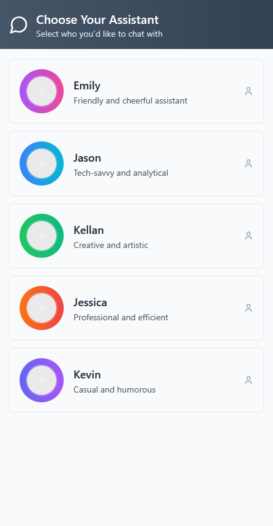
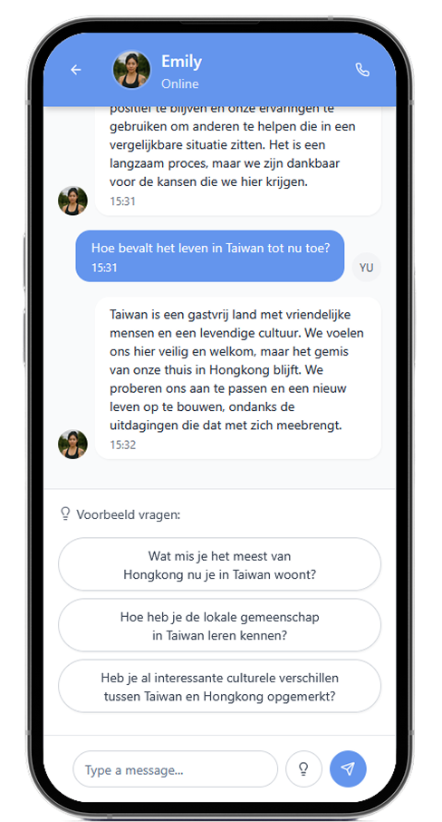
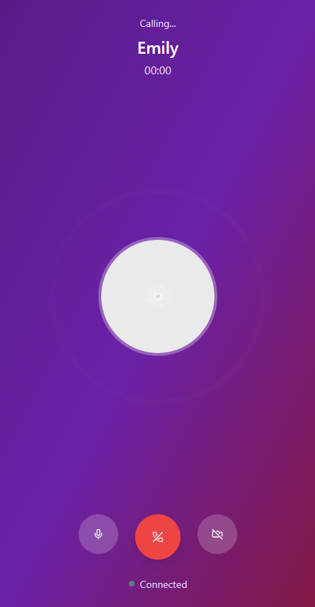

# README

## Chat Interface Prototype

De Chat Interface is een prototype dat zich focust op het maken van een bekende omgeving en een optie voor minder directe interactie. Het neemt de vorm aan van een interface dat vergelijkbaar is met bijvoorbeeld Whatsapp. Hierin kunnen gebruikers berichten sturen naar de persona’s en antwoorden terugkrijgen. Ook kunnen ze bellen met persona’s om de functie van prototype 1 te benutten.

Het doel van dit concept is om het praten met de persona toegankelijker te maken. Berichten sturen is makkelijker dan praten. Uit het eerste doelgroeponderzoek bleek dat niet iedereen even enthousiast was om zelf te praten met de AI persona’s, dit prototype biedt een optie om dit te verhelpen.

[Link naar het online prototype](https://project-emily-chat-interface.vercel.app/)

### Proces

Dit prototype komt voort uit een ander concept dat tijdens een hackathon is ontstaan. We kregen namelijk mee dat niet iedereen het prettig vindt om direct met een beeld (zoals een avatar of webcam) te communiceren met een persona. Daarom besloot ik om een messaging-app te bouwen, vergelijkbaar met WhatsApp.

Ik gaf hiervoor eerst de volgende prompt aan Loveable:

```
Design a charming, user-friendly chat interface for a mobile app where users can engage in conversations with Emily—a friendly virtual companion. Include an easy-to-access call function, allowing users to initiate voice calls with Emily. Prioritize a modern, inviting design that makes users feel at ease and connected.
```

Dit gaf al een sterke basis voor een message-app met Emily. Hierna ben ik erop voortgegaan door functionaliteit toe te voegen voor de call function:

```
Add the call functionality behind the call button. Make it so it visually works, but it does not need to make or record sound.
```

Het laatste wat ik met Loveable heb gedaan was het toevoegen van meerdere gesprekspartners. Ik heb tussendoor geprobeerd om Loveable de ChatGPT integratie te laten maken, maar dit werkte niet goed. Daarom heb ik na deze versie verder gewerkt in Cursor.

```
Create a menu with multiple people/ai that you can go to. I need a back button on the current page and then the same interface for multiple people. Their names should be Jason, Kellan, Jessica, Kevin
```

_Het prototype vanuit Loveable:_



Hierna ben ik verder gegaan in Cursor. Hierin heb ik ChatGPT integratie toegevoegd op een veilige manier. Ik heb Cursor gevraagd om de integratie te maken en daarna met ChatGPT zelf gekeken naar de veiligste manieren om mijn API KEY te gebruiken. Ook heb ik zelf avatars toegevoegd.

Dat kwam uit op het prototype wat er nu is. De API KEY is te vinden in een lokale .env file en in het online prototype staat het ingevuld in het Vercel project. Dit zorgt ervoor dat de key veilig is en niet gevonden kan worden door gebruikers.
