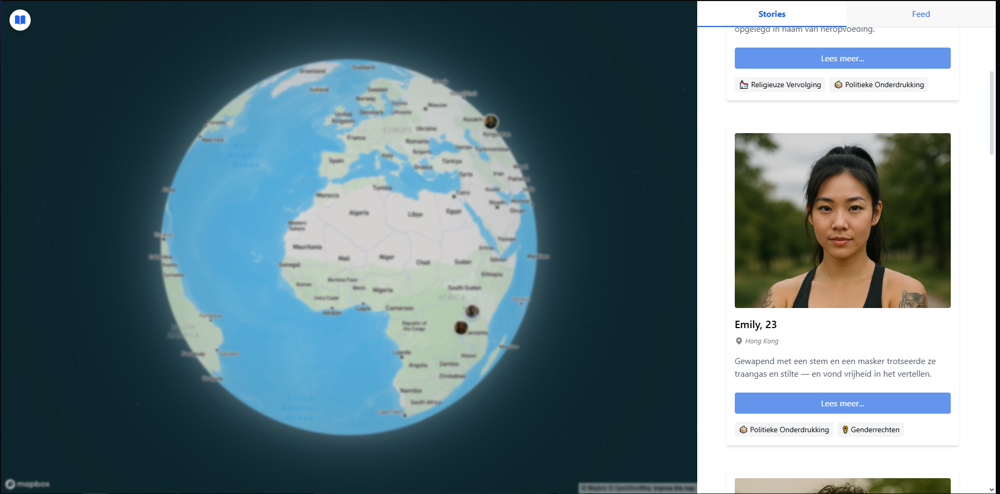
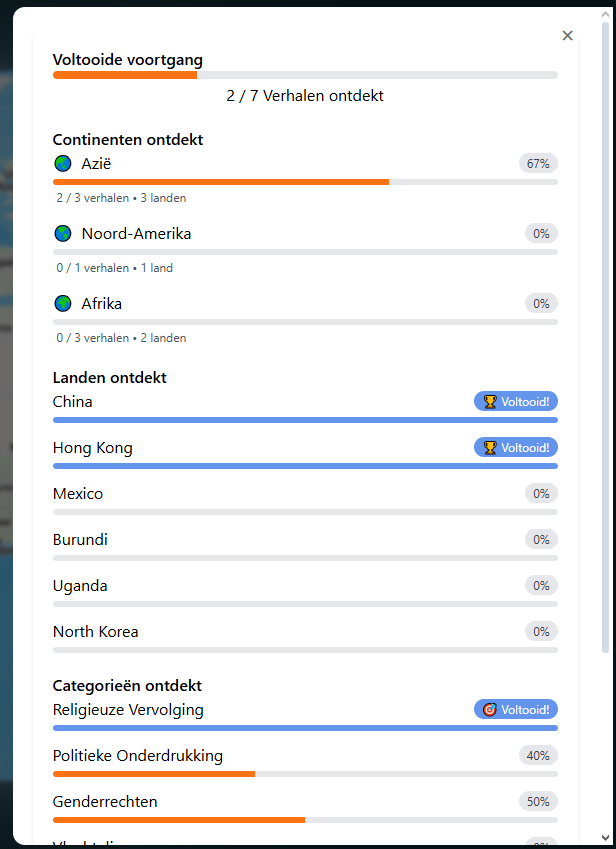

# 🌍 Interactive Globe - Human Rights Stories

I have created an immersive web application that tells the stories of people around the world who have faced human rights challenges. Users can explore an interactive 3D globe, discover personal narratives, track their progress through different categories of human rights issues and regions, and engage with a dynamic social feed that simulates real-time community interaction.

For this project I worked with cursor AI and GPT to create this prototype that you can visit on
https://hover-cards-emily.vercel.app 



## Features

- **Interactive 3D Globe**: Navigate a beautiful 3D globe powered by Mapbox GL
- **Personal Stories**: Explore detailed narratives from 7 individuals across different countries
- **Progress Tracking**: Monitor your exploration progress with a comprehensive tracking system

- **Category Filtering**: Filter stories by human rights categories (Religious Persecution, LGBTQ+ Rights, Racism, etc.)
- **Dynamic Social Feed**: Real-time social media feed with posts, likes, comments, and tags
- **Tab System**: Switch between Stories and Social Feed views
- **Responsive Design**: Works seamlessly on desktop and mobile devices
- **Dutch Localization**: Fully localized interface in Dutch
- **Visual Feedback**: Hover cards, visited state indicators, and smooth animations

## Story Categories

- **Religieuze Vervolging** (Religious Persecution) ⛪
- **LHBTI+ Rechten** (LGBTQ+ Rights) 🏳️‍🌈
- **Racisme** (Racism) ✊
- **Politieke Onderdrukking** (Political Oppression) 🗳️
- **Genderrechten** (Gender Rights) ♀️
- **Vluchteling** (Refugee Status) 🏃

## Social Feed Features

- **Real-time Posts**: New posts appear every 15 seconds from the Social API
- **Interactive Engagement**: Like posts and add comments
- **Smart Tagging**: Posts are tagged as Trending, Urgent, or Unpopular with color-coded styling
- **Persistent State**: Feed maintains posts when switching between tabs
- **Randomized Content**: Posts appear in random order without recent repeats
- **API Integration**: Fetches real content and images from https://social-api-sm1s.onrender.com

## Quick Start

### Prerequisites

- Node.js (version 14 or higher) [](#)
- npm or yarn package manager 	[](#) 	[](#)
- Modern web browser with WebGL support

### Installation

1. **Clone the repository**
   ```bash
   git clone https://github.com/NielsdeLaat/project-emily-prototypes/tree/development-lin/globe-react 
   cd globe-react
   ```

2. **Install dependencies**
   ```bash
   npm install
   ```

3. **Start the development server**
   ```bash
   npm run dev
   ```

4. **Open your browser**
   Navigate to `http://localhost:5173` to view the application

## 🎮 How to Use

### Exploring the Globe
- **Navigate**: Click and drag to rotate the globe
- **Zoom**: Use scroll wheel or pinch gestures to zoom in/out
- **Countries**: Click on any country to see stories from that location
- **Markers**: Click on story markers to view detailed narratives

### Reading Stories
- **Hover Cards**: Hover over markers to see story previews
- **Full Stories**: Click "Lees verder" to read complete narratives
- **Chat Function**: Access chat functionality after reading stories
- **Progress Tracking**: View your exploration progress in the top-left corner

### Social Feed Interaction
- **Tab Navigation**: Switch between "Stories" and "Feed" tabs in the sidebar
- **Real-time Updates**: Watch new posts appear every 15 seconds
- **Engage**: Like posts and add comments to interact with the community
- **Tag System**: Posts are categorized with color-coded tags (Trending/Urgent/Unpopular)

### Filtering Content
- **Category Filters**: Use the filter panel to focus on specific human rights issues
- **Country View**: Click countries to see all stories from that location
- **Search Results**: View filtered results with clear feedback

## Technologies Used

- **React 18**: Modern React with hooks and functional components [](#)
- **Mapbox GL JS**: Interactive 3D globe and mapping 
- **Tailwind CSS**: Utility-first CSS framework for styling [](#)
- **Vite**: Fast build tool and development server 	[](#)
- **Social API**: Real-time social feed integration
- **Local Storage**: Progress tracking and user state persistence

## Project Structure

```
globe-react/
├── public/                 # Static assets
├── src/
│   ├── components/         # React components
│   │   ├── ProgressOverview.jsx
│   │   └── SocialFeed.jsx  # Social feed component
│   ├── utils/             # Utility functions
│   │   └── progressUtils.js
│   ├── img/               # Story character images
│   ├── App.jsx            # Main application component
│   ├── GlobeView.jsx      # Core globe functionality
│   └── main.jsx           # Application entry point
├── package.json           # Dependencies and scripts
└── README.md             # This file
```

## Customization

### Adding New Stories
1. Add character images to `src/img/`
2. Update the `sidebarItems` array in `GlobeView.jsx`
3. Add expanded story content to the `expandedStories` object
4. Update progress tracking utilities if needed

### Social Feed Configuration
- Modify feed update interval in `GlobeView.jsx` (currently 15 seconds)
- Update tag styling in `SocialFeed.jsx`
- Customize post types and categories
- Adjust recent post tracking (currently prevents last 5 posts from repeating)

### Styling
- Modify Tailwind classes in components
- Update CSS variables in `src/index.css`
- Customize color scheme in `tailwind.config.cjs`

### Localization
- Update text content in `GlobeView.jsx`
- Modify category labels and descriptions
- Update tooltips and UI text

## Configuration

### Mapbox Token
Replace the Mapbox access token in `GlobeView.jsx`:
```javascript
mapboxgl.accessToken = 'your-mapbox-token-here';
```

### Social API
The application integrates with the Social API at `https://social-api-sm1s.onrender.com`. Ensure the API is accessible for full social feed functionality.

### Story Data
Update story locations, categories, and content in the `sidebarItems` and `expandedStories` objects.

## Troubleshooting

### Common Issues

**Globe not loading**
- Check your Mapbox access token
- Ensure you have an active internet connection
- Verify WebGL support in your browser

**Stories not appearing**
- Check the browser console for JavaScript errors
- Verify that all image files are present in `src/img/`
- Ensure story data is properly formatted

**Social Feed not loading**
- Check internet connection for API access
- Verify the Social API endpoint is accessible
- Check browser console for network errors

**Progress not saving**
- Check if localStorage is enabled in your browser
- Clear browser cache and try again
- Verify the progress utility functions

**Tab switching issues**
- Ensure you're using a modern browser
- Check for JavaScript errors in the console
- Verify that all components are properly mounted

## Contributing

We welcome contributions! Please follow these steps:

1. **Fork the repository**
2. **Create a feature branch**: `git checkout -b feature/amazing-feature`
3. **Commit your changes**: `git commit -m 'Add amazing feature'`
4. **Push to the branch**: `git push origin feature/amazing-feature`
5. **Open a Pull Request**

### Development Guidelines
- Follow React best practices
- Use meaningful commit messages
- Test your changes thoroughly
- Update documentation as needed
- Ensure social feed functionality works correctly
- Test tab switching and state persistence

## License

This project is open source and licensed under the MIT License

## Acknowledgments

- **Mapbox** for providing the 3D globe technology
- **React Team** for the amazing framework
- **Tailwind CSS** for the utility-first styling approach
- **Social API** for providing real-time social feed content
- **All contributors** who help improve this project


**Made with ❤️ for human rights education and awareness** 
