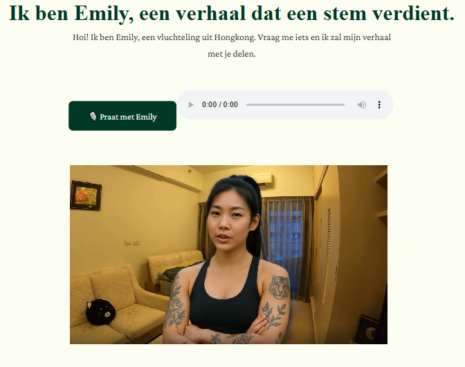

[](#)
[](#)
[](#)
[](#)


# Virtual Human – Emily

**Emily** is a virtual AI persona you can talk to about her experience during the Hong Kong protests. This prototype explores how emotionally realistic conversations with AI characters can raise awareness of sensitive topics through interactive storytelling.



---

## Features

- 🗣️ AI-powered conversation with a virtual human
- 🎭 Emotionally engaging character with a real backstory
- 🧩 Visual chat interface mimicking mobile messaging apps
- 🔒 Locally run with API key authentication

---

## Installation

1. **Clone this repository**  
   ```bash
   git clone https://github.com/NielsdeLaat/project-emily-prototypes.git
   cd virtual-human

2. **Install dependencies**
    ```bash
    npm install
    
3. **Add keys & .env file**
   In the root file, create an env. file and add your open ai key and elevenlabs key
   
4. Run the Development server
   ```bash
   npm run dev

5. Open in browser
Visit: http://localhost:5173 

**##Project Goal**
This prototype is part of a design research project focused on digital empathy and storytelling through virtual humans. Emily is a fictional character based on real protest experiences in Hong Kong. The goal is to explore how AI can deliver emotional, human-like narratives to increase awareness of sensitive political and social topics.

## License
This project is a demo created for educational purposes.
Not intended for commercial or production deployment.

## Created by
Lin Hui Ye - 488316
Media & Design student – Fontys Hogeschool
